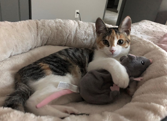

# Anna Samen

## Double majoring in Mathematical Programming and Criminology/ Criminal Justice

I want to be a crime analyst and am currently doing an independent study to learn the GIS system. When i graduate in may, I will go on to complete an online certificate from UCF in crime analystics
